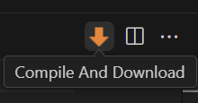
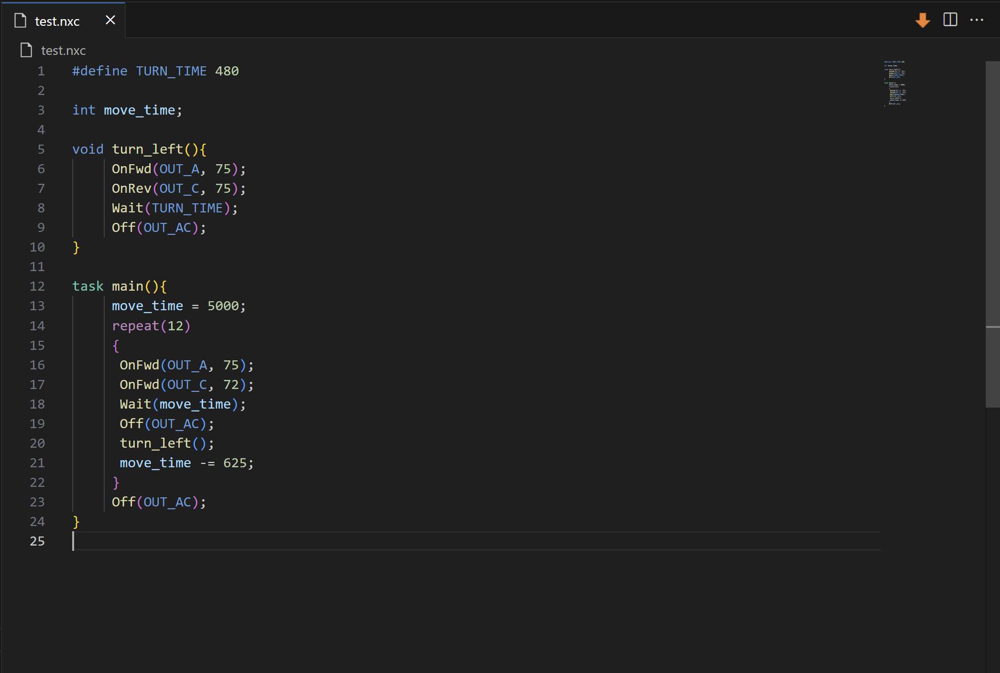

# NXC Language Extension

**This project is a fork of [NQC Highlighter](https://marketplace.visualstudio.com/items?itemName=BirdHouseWorks.nqchighlighter) from [BirdHouseWorks](https://github.com/nowaythatsok).** Original README can be found [here](NQC_Highlighter_README.md).

This extension adds language support for the third party [NXC language and NBC compiler](https://bricxcc.sourceforge.net/nbc/) used for programming the LEGO NXT brick.

## Language Features

NXC language features include:
- Syntax highlighting
- Snippets for important functions/constants
- Custom action in the editor toolbar for compiling and downloading to an NXT brick over USB

**In order to use compiler integration features, you will have to have the NBC compiler pre installed on your machine.**

The extension will attempt to auto-detect the compiler in the default installation path (`C:\Program Files (x86)\BricxCC`). This location can be changed in the [extension settings](vscode://settings/NXC.nbcCompilerPath).

## Contributing

If you feel this extension is missing something, feel free to contribute on [GitHub](https://github.com/hwschieding/nxc_vscode_extension).

## NQC Support

**This project is a fork of [NQC Highlighter](https://marketplace.visualstudio.com/items?itemName=BirdHouseWorks.nqchighlighter) from [BirdHouseWorks](https://github.com/nowaythatsok).**

Any support for [NQC](http://bricxcc.sourceforge.net/nqc/) in that project remains in this one.

[Original README](NQC_Highlighter_README.md)